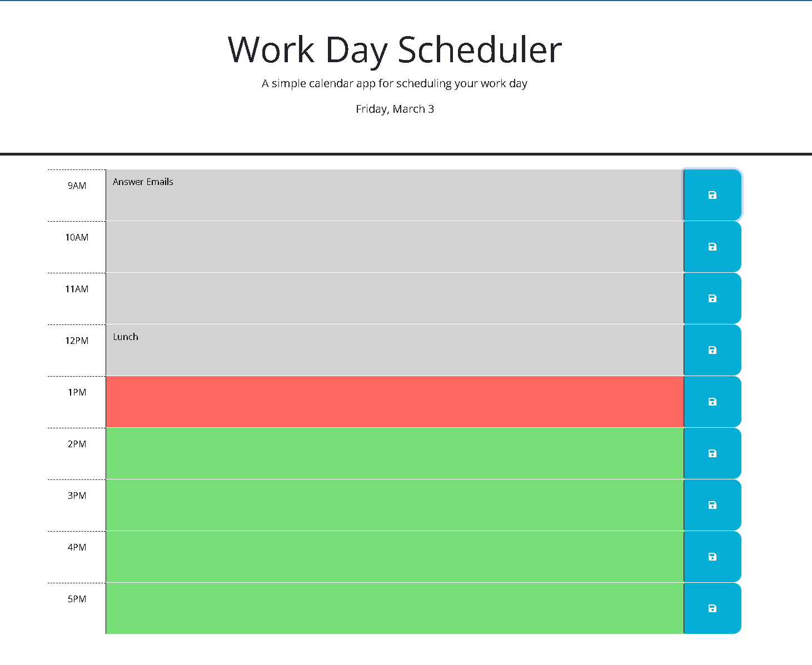

# Work Day Scheduler

## Description
This application is a day scheduler for work hours from nine to five. The current day is displayed at the top of the screen. Tasks to be completed can be placed in each time block, and they are color coded. A row colored gray represents a time block in the past, a red colored row is the current hour and a green colored row represents a time block in the future.

A save button next to each time block will store the info entered in the accompanying text field so that the task is not lost if the page is closed or navigated away from.

[GitHub Repo](https://github.com/edrezner/Work-Day-Scheduler) 

[Website](https://edrezner.github.io/Work-Day-Scheduler/)

Preview Image:

## Usage
Enter tasks, events, meetings, etc. in the input fields for that appropriate hour. Press the save button to the right of the input field to save the text. Rows are color coded by time, gray is past, red is present hour, and green is future. 

## Credits
1. Natasha Mann (tutor) - Helped me complete the code in the JavaScript file from lines 37-56 and lines 65-69.

2. https://developer.mozilla.org/en-US/docs/Web/JavaScript/Reference/Global_Objects/Number/Number This page introduced me on how to convert a string to a number using the Number() constructor.

3. https://api.jquery.com/category/traversing/ This page used as guidance on how to target elements and traverse the DOM using jQuery.

4. https://stackoverflow.com/questions/1206739/find-all-elements-on-a-page-whose-element-id-contains-a-certain-text-using-jquer This post helped me to start writing the code beginning on lines 38 and 65 by targetting the elements that contained specified text.